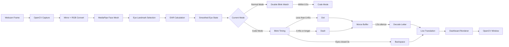
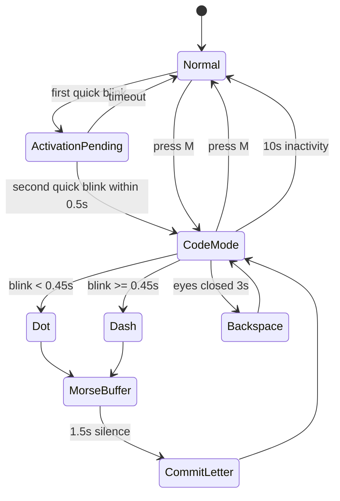
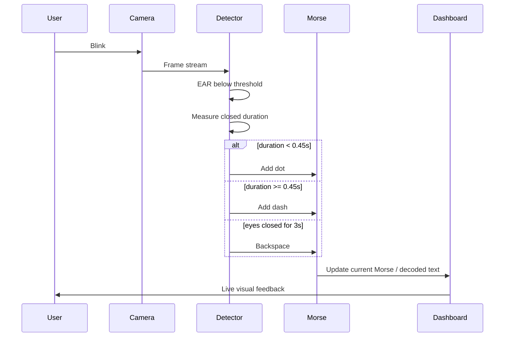

# Eye Blink Morse Code Detector

<p align="center">
  
  
  
  
</p>

<p align="center">
  
  
  
  
</p>

A hands-free Morse code typing system powered by OpenCV, MediaPipe Face Mesh, and real-time blink timing. The app watches your eyes through a webcam, separates normal blinking from intentional code input, and translates controlled blinks into readable text.

The current version includes a polished dark dashboard UI, a larger camera feed, live translation, Morse preview, status pills, keyboard shortcuts, calibration tools, a face-mesh debug toggle, and a new long-eye-close backspace gesture.


---

## Sticker Sheet

These badges summarize the current app behavior at a glance.

| Sticker | Meaning |
| --- | --- |
| `Camera Feed` | Large crop-to-fill webcam preview, no stretching |
| `Code Mode` | Intentional Morse input mode after double blink or `M` |
| `Clean / Debug` | Press `D` to hide or show face mesh landmarks |
| `Dot < 0.45s` | Short blink is recorded as a dot |
| `Dash >= 0.45s` | Longer blink is recorded as a dash |
| `Backspace 3s` | Hold eyes closed for 3 seconds in Code Mode |
| `Save S` | Save current message to `morse_output.txt` |

---

## Demo

A demo video is included in the repository:

[Watch the demo video](EBMD.mp4)

---

## What This Project Does

Eye Blink Morse Code Detector turns eye blinks into text using Morse code timing:

- Short blink: dot (`.`)
- Long blink: dash (`-`)
- Pause after a sequence: commits the Morse letter
- Longer pause after text: adds a word space
- Hold eyes closed for 3 seconds: backspace

The app has two operating modes:

- Normal Mode: natural blinking is ignored.
- Code Mode: intentional blinks are translated into Morse code.

This keeps the system usable in real life because the app does not treat every ordinary blink as input.

---

## Current Feature Set

### Dashboard UI

The app now renders a custom OpenCV dashboard instead of plain text directly over the camera feed.

The dashboard includes:

- Large camera feed panel
- Live translation panel
- Current Morse sequence display
- Status badges for camera, face, eyes, mode, FPS, EAR, threshold, and clean/debug mode
- Shortcut toolbar
- Help overlay
- Debug overlay toggle for face mesh and eye landmarks

### Blink-Based Morse Input

- Double blink quickly to enter Code Mode.
- Blink shortly for dots.
- Hold a blink longer for dashes.
- Pause to commit a letter.
- Hold eyes closed for 3 seconds to backspace.

### Debug Overlay

Press `D` to toggle the MediaPipe face mesh overlay.

When debug overlay is on, the camera feed shows:

- Full face mesh tessellation
- Red right-eye landmark points
- Blue left-eye landmark points
- Eye bounding boxes
- Per-eye EAR labels

When debug overlay is off, the camera feed stays clean and polished.


### Visual Architecture


### Calibration Tools

The app exposes keyboard controls for tuning EAR threshold live:

- Press `C` to print calibration guidance.
- Press Up Arrow to increase the EAR threshold.
- Press Down Arrow to decrease the EAR threshold.
- Press `T` to auto-adjust threshold from the current EAR value.

---

## Installation

### Requirements

- Python 3.10 or newer recommended
- Webcam
- Good front-facing light
- Dependencies listed in `requirements.txt`

### Install Dependencies

```bash
pip install -r requirements.txt
```

Or install manually:

```bash
pip install opencv-python mediapipe numpy
```

### Run the App

```bash
python eye_blink_morse.py
```

A window titled `Eye Blink Morse Code Detector` will open.

---

## Quick Start

1. Start the app:

```bash
python eye_blink_morse.py
```

2. Sit centered in the camera frame.

3. Confirm the dashboard shows:

- `Camera`
- `Face`
- `Eyes Open`

4. Double blink quickly to enter Code Mode.

5. Use blinks to type Morse:

- Short blink for dot
- Longer blink for dash
- Pause for letter commit
- Longer pause for word space

6. Hold eyes closed for 3 seconds to delete the last character.

7. Press `S` to save your message to `morse_output.txt`.

---

## Keyboard Controls

All letter shortcuts work with uppercase or lowercase input because the app normalizes keyboard events with `cv2.waitKeyEx`.

| Key | Action | Description |
| --- | --- | --- |
| `Q` | Quit | Exit the application |
| `R` | Reset | Clear decoded message and current Morse sequence |
| `S` | Save | Append the current decoded message to `morse_output.txt` |
| `P` | Pause | Pause or resume face tracking and detection |
| `M` | Mode | Manually toggle Code Mode on or off |
| `H` | Help | Toggle the in-window help overlay |
| `C` | Calibrate | Print calibration instructions and current EAR values |
| `T` | Auto-adjust | Set threshold from the current EAR value |
| `D` | Debug | Toggle face mesh and eye landmark overlay |
| Up Arrow | Threshold up | Increase EAR threshold by `0.01` |
| Down Arrow | Threshold down | Decrease EAR threshold by `0.01` |

---

## Gesture Controls

### Activate Code Mode

You can enter Code Mode in two ways:

| Gesture / Key | Behavior |
| --- | --- |
| Quick double blink | Activates Code Mode if both blinks happen within `0.5s` |
| `M` | Manually toggles Code Mode |

Only quick activation blinks are used for double-blink activation. Natural long blinks outside Code Mode are ignored.

### Type Morse Code

In Code Mode:

| Blink | Meaning | Timing |
| --- | --- | --- |
| Short blink | Dot (`.`) | Less than `0.45s` |
| Long blink | Dash (`-`) | `0.45s` or longer |
| Pause | Commit letter | `1.5s` after last signal |
| Longer pause | Add word space | `7.0s` after last signal |
| Eyes closed hold | Backspace | `3.0s` continuous close |

### Backspace

Backspace is no longer entered with 8 dots.

The current behavior is:

- Hold your eyes closed for 3 seconds while in Code Mode.
- The app deletes one character from the decoded message.
- If a Morse sequence is still pending, it clears that pending sequence first.
- It will not repeatedly delete while your eyes remain closed.

---

## Dashboard Guide

The dashboard is arranged like a control surface: large camera preview on the left, translation state on the right, live status below, and shortcut buttons at the bottom.

```text
+--------------------------------------------------------------------------------+
| Eye Blink Morse Translator                         [Camera] [Code Mode] [Help] |
+--------------------------------------------------------------------------------+
|                                |                                               |
|  Camera Feed                   |  Live Translation                              |
|  +--------------------------+  |  +-----------------------------------------+  |
|  | Face / Eyes pills        |  |  | Decoded text                            |  |
|  |                          |  |  | Recent blink events                     |  |
|  | Large webcam preview     |  |  | Current Morse: dot/dash preview         |  |
|  | Clean or debug overlay   |  |  | Timeout/status line                     |  |
|  +--------------------------+  |  +-----------------------------------------+  |
|                                |                                               |
+--------------------------------------------------------------------------------+
| [Camera] [Face] [Open/Closed] [Mode] [FPS] [EAR] [TH] [Clean/Debug]            |
+--------------------------------------------------------------------------------+
| [Reset R] [Save S] [Calibrate C] [Auto T] [Help H] [Pause P] [Mode M] [D] [Q] |
+--------------------------------------------------------------------------------+
```

### Header

The header shows the app name and quick state pills:

- Camera status
- Code Mode state
- Help shortcut

### Camera Feed Panel

The camera feed is large and uses a crop-to-fill preview so it fills the panel without stretching your face.

Inside the feed:

- `Face` means MediaPipe currently detects a face.
- `No Face` means the app cannot detect facial landmarks.
- `Eyes Open` / `Eyes Closed` comes from the smoothed EAR threshold.
- `Paused` appears when detection is paused.

### Live Translation Panel

This panel shows:

- Decoded text
- Recent blink event badges
- Current Morse sequence
- Code Mode timeout text

### Status Bar

The status bar shows:

| Pill | Meaning |
| --- | --- |
| Camera | Camera/read state |
| Face | Whether a face is detected |
| Open / Closed | Current eye state |
| Normal / Code Mode | Current input mode |
| FPS | Estimated frame rate |
| EAR | Current smoothed Eye Aspect Ratio |
| TH | Current EAR threshold |
| Clean / Debug | Whether face mesh overlay is hidden or visible |

### Shortcut Toolbar

The toolbar displays common controls:

- Reset
- Save
- Calibrate
- Auto
- Help
- Pause
- Mode
- Debug
- Quit

---

## Timing Defaults

The main tuning values live near the top of `eye_blink_morse.py`.

| Setting | Current Value | Purpose |
| --- | ---: | --- |
| `EAR_THRESHOLD` | `0.15` | EAR below this is treated as closed eyes |
| `EAR_SMOOTHING` | `3` frames | Rolling average size for EAR smoothing |
| `MIN_CONSEC_FRAMES` | `1` frame | Frames below threshold needed to start a blink |
| `DEBOUNCE_TIME` | `0.08s` | Minimum time between accepted blinks |
| `DOT_DASH_TIME` | `0.45s` | Blink duration cutoff between dot and dash |
| `BACKSPACE_HOLD_TIME` | `3.0s` | Continuous eye-close duration for backspace |
| `LETTER_GAP` | `1.5s` | Silence needed to commit a Morse letter |
| `WORD_GAP` | `7.0s` | Silence needed to add a word space |
| `DOUBLE_BLINK_GAP` | `0.5s` | Max gap between activation blinks |
| `CODE_MODE_TIMEOUT` | `10.0s` | Inactivity timeout for Code Mode |
| `ACTIVATION_BLINK_DURATION` | `0.15s` | Max blink duration for activation blinks |

---

## How It Works

### Mode State Diagram



### Timing Diagram



### Backspace Gesture Diagram

```text
Code Mode active
     |
     v
Eyes close and stay below EAR threshold
     |
     +-- less than 3.0s --> normal dot/dash classification on reopen
     |
     +-- 3.0s reached --> clear pending Morse, delete one character, suppress repeat
```

### Processing Pipeline

```text
Webcam frame
    -> mirror frame with OpenCV
    -> convert BGR to RGB
    -> MediaPipe Face Mesh detects landmarks
    -> selected eye landmarks are converted to pixels
    -> Eye Aspect Ratio is calculated for both eyes
    -> smoothed EAR determines open/closed state
    -> blink timing classifies dot, dash, activation, or backspace
    -> Morse sequence is translated to text
    -> dashboard is rendered with OpenCV
```

### Eye Aspect Ratio

The app uses six MediaPipe landmarks for each eye.

```text
EAR = (vertical_1 + vertical_2) / (2 * horizontal)
```

When eyes close, the vertical distances shrink and EAR drops. If the smoothed EAR goes below `EAR_THRESHOLD`, the app treats the eyes as closed.

Selected indices:

| Eye | Landmark Indices |
| --- | --- |
| Right eye | `33, 160, 158, 133, 153, 144` |
| Left eye | `362, 385, 387, 263, 373, 380` |

### Code Mode State Machine

```text
Normal Mode
    - ignores ordinary blinks
    - watches for quick double blink
    - can be toggled manually with M

Code Mode
    - short blink -> dot
    - long blink -> dash
    - 1.5s pause -> commit current Morse letter
    - 7.0s pause -> add word space
    - 3.0s eyes closed -> backspace
    - 10.0s inactivity -> return to Normal Mode
```

---

## Morse Code Support

### Letters

| Letter | Morse | Letter | Morse | Letter | Morse |
| --- | --- | --- | --- | --- | --- |
| A | `.-` | B | `-...` | C | `-.-.` |
| D | `-..` | E | `.` | F | `..-.` |
| G | `--.` | H | `....` | I | `..` |
| J | `.---` | K | `-.-` | L | `.-..` |
| M | `--` | N | `-.` | O | `---` |
| P | `.--.` | Q | `--.-` | R | `.-.` |
| S | `...` | T | `-` | U | `..-` |
| V | `...-` | W | `.--` | X | `-..-` |
| Y | `-.--` | Z | `--..` | | |

### Numbers

| Number | Morse | Number | Morse |
| --- | --- | --- | --- |
| 0 | `-----` | 1 | `.----` |
| 2 | `..---` | 3 | `...--` |
| 4 | `....-` | 5 | `.....` |
| 6 | `-....` | 7 | `--...` |
| 8 | `---..` | 9 | `----.` |

### Punctuation

Supported punctuation includes:

```text
. , ? ' ! / ( ) & : ; = + - _ " $ @
```

Unknown Morse patterns are translated as `?`.

---

## Saving Output

Press `S` to save the current decoded message.

Messages are appended to:

```text
morse_output.txt
```

Each saved line includes a timestamp:

```text
YYYY-MM-DD HH:MM:SS: YOUR MESSAGE
```

If there is no message, the app prints `No message to save`.

---

## Calibration Guide

Good calibration makes the app much easier to use.

### Recommended Setup

- Face the camera directly.
- Keep your face centered.
- Use steady front lighting.
- Avoid strong backlight.
- Keep the camera stable.
- Sit at a comfortable distance.

### Manual Calibration

1. Start the app.
2. Look at the `EAR` and `TH` status pills.
3. Keep your eyes open.
4. Press `C` to print the current values.
5. Press Up Arrow if the app says your eyes are open when they are actually closed.
6. Press Down Arrow if the app says your eyes are closed when they are actually open.

### Auto Calibration

Press `T` while your eyes are open. The app sets:

```text
EAR_THRESHOLD = current_EAR - 0.02
```

This is a quick helper, not a perfect calibration. Manual adjustment may still be needed.

---

## Troubleshooting

### The app says `No Face`

Try:

- Move closer to the camera.
- Improve lighting.
- Face the camera directly.
- Make sure another app is not using the webcam.
- Try a different camera index by editing the `main(camera_index=0)` call.

### It detects closed eyes while my eyes are open

Try:

- Press Down Arrow to lower the threshold.
- Use brighter lighting.
- Press `T` while your eyes are open.

### It misses blinks

Try:

- Press Up Arrow to raise the threshold.
- Blink more deliberately.
- Enable debug overlay with `D` and check if the eye landmarks are stable.

### Dashes happen too easily

The dash cutoff is currently `0.45s`.

If dashes are still too easy, increase:

```python
DOT_DASH_TIME = 0.45
```

### Backspace is not triggering

Backspace only works in Code Mode. Hold your eyes closed continuously for 3 seconds.

### The face mesh is not visible

Press `D` to toggle the debug overlay.

---

## Project Files

```text
EyeBlinkMorseDetector/
|-- eye_blink_morse.py      Main application
|-- requirements.txt        Python dependencies
|-- README.md               Project documentation
|-- EBMD.mp4                Demo video
|-- .gitignore              Git ignore rules
```

---

## Code Structure

### `MORSE_CODE`

Dictionary that maps Morse patterns to letters, numbers, and punctuation.

### EAR Helpers

- `euclidean(a, b)` computes distance between two points.
- `compute_ear(...)` computes Eye Aspect Ratio.
- `landmarks_to_pixel_coords(...)` converts MediaPipe normalized landmarks to pixel coordinates.

### Morse Helpers

- `morse_to_char(pattern)` converts a Morse pattern to a character.
- `process_morse_command(pattern, decoded_message)` commits a translated pattern to the message.

### Dashboard Helpers

- `draw_round_rect(...)` draws rounded OpenCV panels.
- `draw_text(...)` draws clipped text.
- `draw_pill(...)` draws status pills.
- `place_image_fit(...)` fills the camera panel without stretching.
- `draw_morse_symbols(...)` renders dot/dash indicators.
- `draw_event_stack(...)` renders recent events.
- `build_dashboard(...)` builds the full UI frame.

### Main Loop

`main(...)` handles:

- Camera setup
- MediaPipe setup
- Face and eye tracking
- Blink state machine
- Code Mode activation
- Backspace hold detection
- Morse decoding
- Dashboard rendering
- Keyboard shortcuts
- Cleanup

---

## Customization

### Change Camera Index

If your default camera does not open, edit the bottom of `eye_blink_morse.py`:

```python
if __name__ == "__main__":
    main(camera_index=1)
```

### Change Dash Sensitivity

Increase this to require a longer blink for dashes:

```python
DOT_DASH_TIME = 0.45
```

### Change Backspace Hold Duration

Increase or decrease this value:

```python
BACKSPACE_HOLD_TIME = 3.0
```

### Change Code Mode Timeout

```python
CODE_MODE_TIMEOUT = 10.0
```

### Change Letter or Word Gaps

```python
LETTER_GAP = 1.5
WORD_GAP = 7.0
```

---

## Current Behavior Summary

| Feature | Current Behavior |
| --- | --- |
| Code Mode activation | Quick double blink or `M` |
| Dot | Blink shorter than `0.45s` |
| Dash | Blink `0.45s` or longer |
| Letter commit | `1.5s` pause after signal |
| Word space | `7.0s` pause after signal |
| Backspace | Hold eyes closed for `3.0s` in Code Mode |
| Debug overlay | Toggle with `D` |
| Help overlay | Toggle with `H` |
| Save output | Press `S` |
| UI | Custom OpenCV dashboard, `1280x820` |

---

## Notes

This project is an assistive-input and computer-vision prototype. It is useful for learning, experimentation, and accessibility exploration, but it should be tested carefully before relying on it in any critical communication workflow.

Lighting, camera quality, face angle, and calibration strongly affect reliability. Use the debug overlay and threshold controls to tune the experience for your setup.
